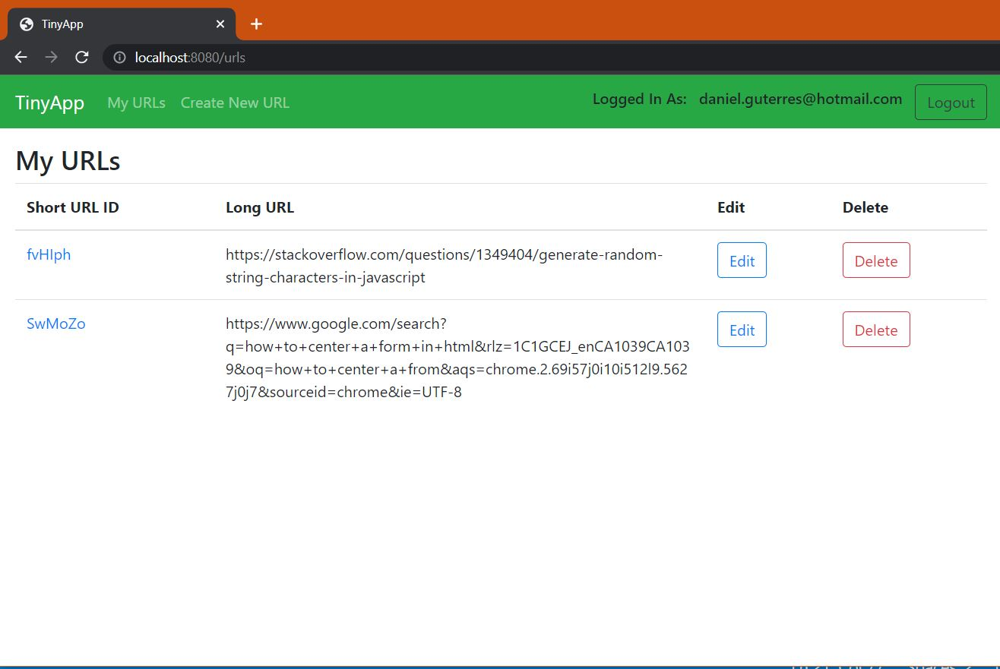
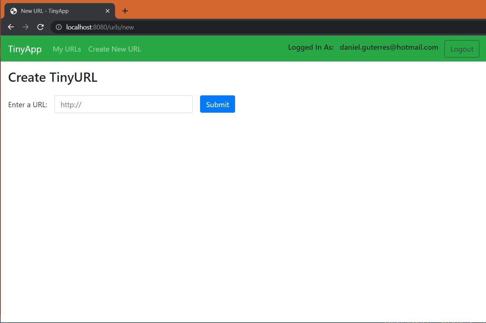

# TinyApp Project

TinyApp is a full stack web application built with Node and Express that allows users to shorten long URLs (à la bit.ly).

The app takes in a url typed by a user in a browser interface, and generates a random string of 6 characters. That 6 character string is set as a shorter version of the url typed by the user. That shorter url is displayed as a link that redirects the user to the corresponding url. A user is expected to register and login in order to use the features provided by this app.

## Final Product

## Dependencies

- Node.js
- Express
- EJS
- bcryptjs
- cookie-session

## Getting Started

- Install all dependencies (using the `npm install` command).
- Run the development web server using the `node express_server.js` command.